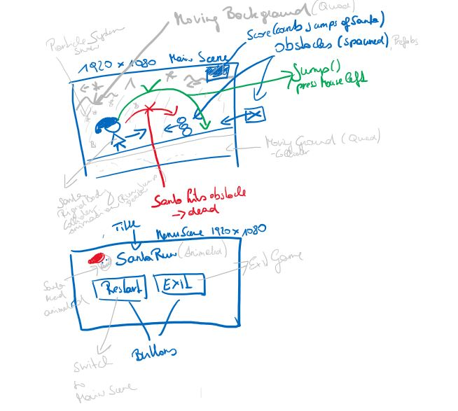

# Santa Run

# Ausarbeitung

## Was ist Refactoring Definition in eigenen Worten?
Refactoring ist das Überarbeiten eines Codes, um diesen nicht nur effizienter vom Maschinen-Standpunkt aus zu machen, sondern auch leserlicher für den Menschen.
## Welche Vorteile/Nachteile birgt Refactoring?
Die Vorteile sind, dass der Code für dritte und für einen selbst besser leserlich ist und man danach leichter weiterarbeiten kann. Der einzige Nachteil ist der zusätzliche Arbeitsaufwand.
## Was sind die Refactoring-Schritte?
Testcase definieren. Schauen ob programm funktioniert. Code Smell beseitigen. Testcase ausprobieren ob alles noch funktioniert. Wenn ja, commiten.
## Prinzipien von gutem Code?
### DRY -Don’t Repeat Yourself
### KISS -Keep it Simple,
### StupidYAGNI -You Ain’t Gonna Need Principle of least Astonishment 
### SoC-Separation of Concerns
## Was versteht man unter Code Smell?
Magical Strings oder Nummer oder zb. Unnötige Methoden. Generell Code der nicht sinnvoll strukturiert ist
## Recherche von 10 Code Smells die euer Projekt betreffen können, inkl. Beschreibung und Beispiel.
1. Magical String – String der mehr als einmal verwendet wird und immer wieder gehardcodet ist.
GameObject Tags die verglichen werden sollte man als variable angeben.
2. Methode zu lange – Methode die mehr als 25 Zeilen Code hat.
Player Controller Script: Der Rotation Code sollte vom Movement Code getrennt sein
3. Magical Value – Ein Wert wie z.B.: float oder int der ohne Beschreibung und Kontext verwendet wird. Die Angabe einer Entfernung bei einem Raycast.
4. Klasse zu lange – Klasse die mehr als 400 Zeilen Code hat.
GameManager und MenuManager haben geteilt jeweils weniger als 400 Zeilen Code.
5. Unnötig viele Methoden – Viele kleinere Methoden welche durch allgemeine ersetzt werden können. 2 separate Methoden die einige Elemente deaktivieren und oder aktivieren können durch Angabe eines boolschen parameter einheitlich gemacht werden.
6. Unnötige Namespace Angaben – Nicht verwendete Namespaces die trotzdem angegeben sind.  
using System.Collections;  
7. Fehlende Angabe von Access Modifiern – private sollte immer angegeben werden auch wenn dies nicht vorgeschrieben ist damit es funktioniert. float number; -> private float number;
Leonhard Schnaitl 16.12.2019 MTIN
8. Variablen Deklaration mitten im Code – Variablen die nicht ganz oben in der Klasse stehen
Eine Variable die man nur in einer bestimmten Methode braucht und sie deshalb direkt über der
Methode deklariert.  
9. Unnötige Leerzeilen – Sinnlos viele Leerzeilen zwischen Zeilen von Code.  
var variable;  
  
-> Eine Zeile reicht als Abstand  
  
private void Method(){}  
10. Flasche Klammern Setzung – Die Klammern werden nicht einheitlich oder unklar gesetzt.

if (true  
)  
{  
//Code}

### Project description: 
This is a simple 2D side-scroll game. The Santa runs from left to right and has to avoid some obstacles by jumping over them.
The game ends when the Santa hits an obstacle.  The goal is to avoid as many obstacles as possible.

### Development platform: 
Windows 10, Unity version 2019.1.14f1, Visual Studio Community 2017, Scripting Runtime Version: .NET 4.0

### Target platform: 
WebGl and Standalone, RefRes: 1920 * 1080

### Visuals: 

https://www.youtube.com/embed/2C74XxBkFfI

### Necessary setup/execution steps: 
For playing the game go to: 
* WebGL: https://hs-teaching.github.io/WegGL-SantaRun/
* Standalone (.exe): Clone project and publish as Standalone

For development: Clone this project. 

### Third party material: 
* This game is based on the game Santa Run developed by Raja Biswas in the Udemy-course Unity 2018 Game Developmen by Example 
[Unity 2018 Game Development by Example](https://www.udemy.com/course/unity-2d-game-development-by-example/).
* Sprites are used from https://www.gameart2d.com/santa-claus-free-sprites.html

### Project state: 
Program is working correctly, no errors, refactoring is needed.
Refactoring needed: 
* del not used namespaces
* del unused variables
* del needless debugs
* del needless comments
* del unused methods
* rename variables (coding standards)
* rename methods (coding standards)
* fix poor conditional clauses
* fix poor formating
* replace magic string
* replace magic number

### Limitations: 
Only one level is implemented. 

### Lessons Learned: 
* Create 2D Scenes
* Use Quads for moving Backgrounds (Textures instead of Sprites)
* Use Particle System for snowing effect.
* Use Scene Management for switching between Scenes
* Create and control Animations (Animation, Animator and Scripts)
* Use the singelton pattern
* Spawn objects
* Use UI elements and manipulate UI elements with scrips

Copyright by smeerws
